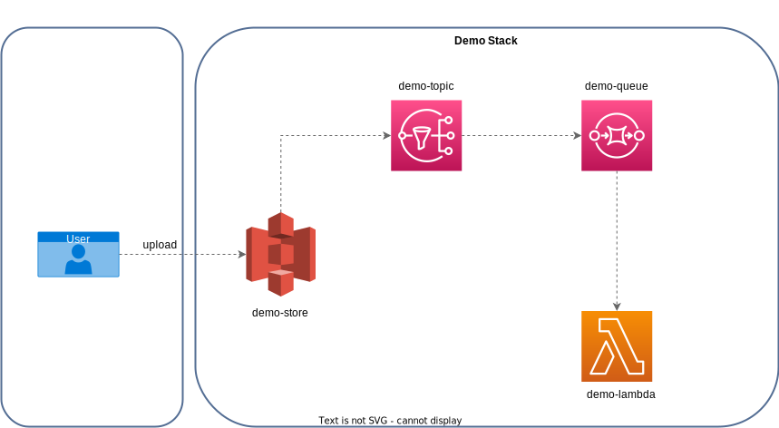

## CDK Demo

 

### Use of CDK with Typescript to exemplify how to provide AWS components. This basic example is an event-driven architecture and shows the starting of a lambda function when a file is created in an s3 bucket as shown in the diagram below.

---
 

### Used services:
- S3
- SNS
- SQS
- System Manager
- Lambda

 

### Diagram

 
<!--  -->
